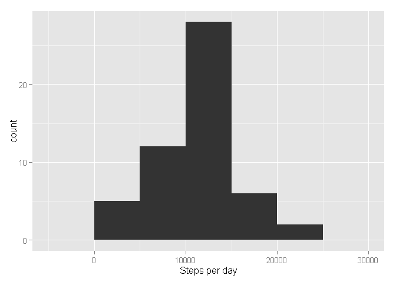
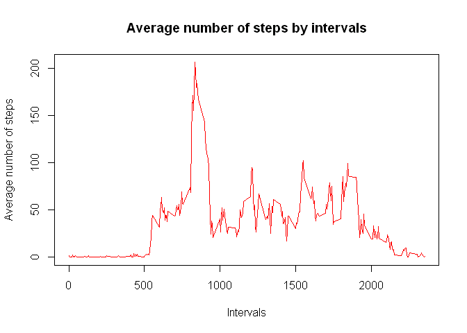
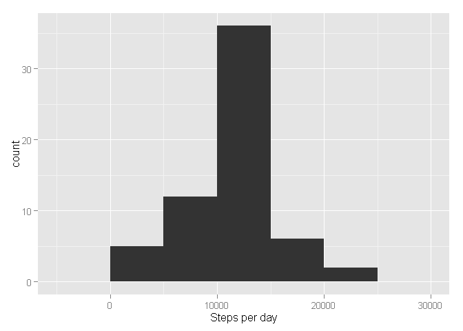
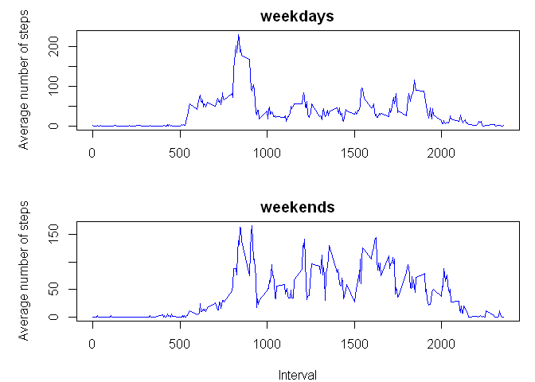

# Reproducible Research: Peer Assessment 1


## Loading and preprocessing the data

```r
unzip("activity.zip")
  
activity_data <- read.csv("activity.csv")

str(activity_data)
```

```
## 'data.frame':	17568 obs. of  3 variables:
##  $ steps   : int  NA NA NA NA NA NA NA NA NA NA ...
##  $ date    : Factor w/ 61 levels "2012-10-01","2012-10-02",..: 1 1 1 1 1 1 1 1 1 1 ...
##  $ interval: int  0 5 10 15 20 25 30 35 40 45 ...
```

```r
activity_data$steps <- as.numeric(activity_data$steps)
activity_data$date <- as.Date(activity_data$date, "%Y-%m-%d")
```


## What is mean total number of steps taken per day?
Calculate number of steps for each day


```r
step_by_date <- aggregate(activity_data$steps, by = list(activity_data$date), FUN = sum)

names(step_by_date) <- c("date", "steps")
```

Plot histogram of steps by date


```r
library(ggplot2)
qplot(step_by_date$steps, geom = "histogram", xlab = "Steps per day", binwidth=5000)
```

 

Calculate mean and meadian of the total number of steps per day.


```r
mean_steps <- mean(step_by_date$steps, na.rm = TRUE)
median_steps <- median(step_by_date$steps, na.rm = TRUE)

cat("mean of the total number of steps per day = ", mean_steps)
```

```
## mean of the total number of steps per day =  10766.19
```

```r
cat("median of the total number of steps by day = ", median_steps)
```

```
## median of the total number of steps by day =  10765
```


## What is the average daily activity pattern?

```r
step_by_interval <- aggregate(activity_data$step, by = list(activity_data$interval), FUN = "mean", na.rm = TRUE) 

names(step_by_interval) <- c("interval", "average_steps")
```

Time series plot of the 5-minute interval (x-axis) and the average number of steps taken, averaged across all days (y-axis)


```r
plot(step_by_interval$interval, step_by_interval$average_steps, type = "l", col = "red", main = "Average number of steps by intervals", xlab = "Intervals", ylab = "Average number of steps")
```

 

Which 5-minute interval, on average across all the days in the dataset, contains the maximum number of steps


```r
max_avg_steps <- max(step_by_interval$average_steps)
interval_with_max_steps <- step_by_interval[step_by_interval$average_steps == max_avg_steps, ]
interval_with_max_steps
```

```
##     interval average_steps
## 104      835      206.1698
```

## Imputing missing values

Calculate and report the total number of missing values in the dataset (i.e. the total number of rows with NAs)


```r
sum(!complete.cases(activity_data))
```

```
## [1] 2304
```


Filling all NA with the average of the interval per day


```r
activity_NA_inputed <- activity_data

activity_NA_inputed$steps[is.na(activity_NA_inputed$steps)]  <- step_by_interval$average_steps
```


```r
steps_by_date_na_filled <- aggregate(activity_NA_inputed$steps, by = list(activity_NA_inputed$date), FUN = "sum")

names(steps_by_date_na_filled) <- c("date", "steps")
```

Plot histogram of steps by date fom NA filled data set


```r
library(ggplot2)
qplot(steps_by_date_na_filled$steps, geom = "histogram", xlab = "Steps per day", binwidth=5000)
```

 

Calculate mean and meadian of the total number of steps per day from data set with NA filled.


```r
mean_steps_na_filled <- mean(steps_by_date_na_filled$steps, na.rm = TRUE)
median_steps_na_filled <- median(steps_by_date_na_filled$steps, na.rm = TRUE)

cat("mean of the total number of steps per day = ", mean_steps_na_filled)
```

```
## mean of the total number of steps per day =  10766.19
```

```r
cat("median of the total number of steps by day = ", median_steps_na_filled)
```

```
## median of the total number of steps by day =  10766.19
```


## Are there differences in activity patterns between weekdays and weekends?

```r
activity_NA_inputed$day <- weekdays(activity_NA_inputed$date)
```


```r
activity_NA_inputed$day <- gsub("Monday", "weekday", activity_NA_inputed$day)
activity_NA_inputed$day <- sub("Tuesday", "weekday", activity_NA_inputed$day)
activity_NA_inputed$day <- sub("Wednesday", "weekday", activity_NA_inputed$day)
activity_NA_inputed$day <- sub("Thursday", "weekday", activity_NA_inputed$day)
activity_NA_inputed$day <- sub("Friday", "weekday", activity_NA_inputed$day)
activity_NA_inputed$day <- sub("Saturday", "weekend", activity_NA_inputed$day)
activity_NA_inputed$day <- sub("Sunday", "weekend", activity_NA_inputed$day)
```


```r
activity_NA_inputed$day <- as.factor(activity_NA_inputed$day)
```


```r
activity_total <- split(activity_NA_inputed, activity_NA_inputed$day)

activity_weekdays <- activity_total[[1]]
activity_weekends <- activity_total[[2]]
```

```r
activity_weekdays_avg <- aggregate(activity_weekdays$steps, by = list(activity_weekdays$interval), FUN = "mean")

names(activity_weekdays_avg) <- c("interval", "average_steps")

activity_weekends_avg <- aggregate(activity_weekends$steps, by = list(activity_weekends$interval), FUN = "mean")

names(activity_weekends_avg) <- c("interval", "average_steps")
```


```r
par(mfrow=c(2,1), mar = c(4, 5, 2, 1))
plot(activity_weekdays_avg$interval, activity_weekdays_avg$average_steps, type = "l", col = "blue", main = "weekdays", xlab = "", ylab = "Average number of steps")

plot(activity_weekends_avg$interval, activity_weekends_avg$average_steps, type = "l", col = "blue", main = "weekends", xlab = "Interval", ylab = "Average number of steps")
```

 
